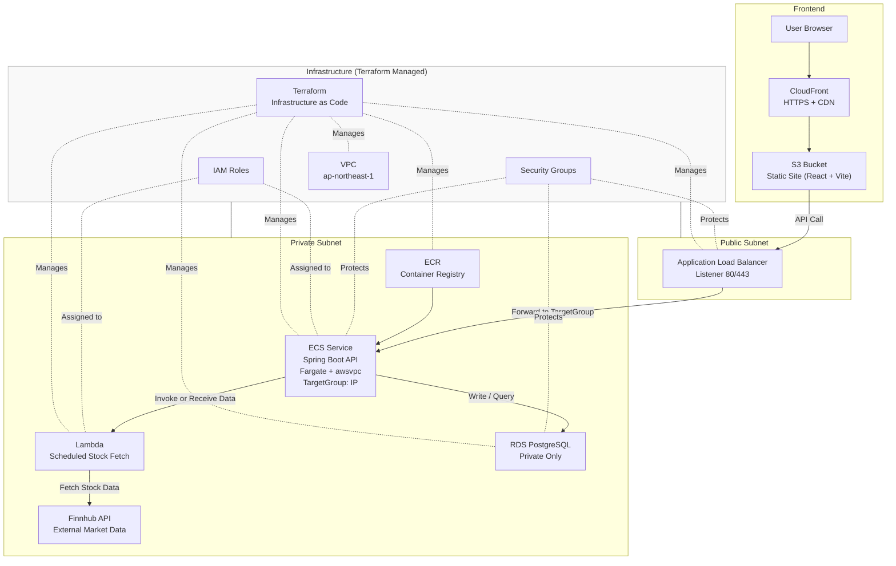

📦 Stock System — Cloud Architecture

🧭 Overview

A fully cloud‑native, production‑ready stock management system deployed on AWS, built with a secure, scalable, and serverless‑first architecture.
This cloud version replaces local Docker Compose orchestration with managed AWS services, enabling high availability, automatic scaling, and infrastructure-as-code provisioning.

Core Components
- Frontend: React + Vite (hosted on S3, delivered via CloudFront CDN)
- Backend: Spring Boot API running on ECS Fargate
- Market Data Fetcher: AWS Lambda (scheduled stock data ingestion)
- Container Registry: Amazon ECR
- Database: Amazon RDS (PostgreSQL, private subnet only)
- Load Balancing: Application Load Balancer (ALB)
- Networking: VPC with public/private subnets, SG‑based isolation
- Infrastructure: Terraform (full IaC)

🏗️ System Architecture

🔧 Local Development Environment

A dedicated local development environment is available in the dev branch.

It includes a Docker Compose–based architecture, service wiring, environment variables, and a separate architecture diagram tailored for local workflows.

For full details, please refer to:

👉 dev branch — Local Development README
