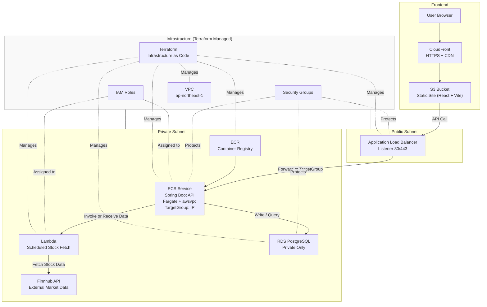
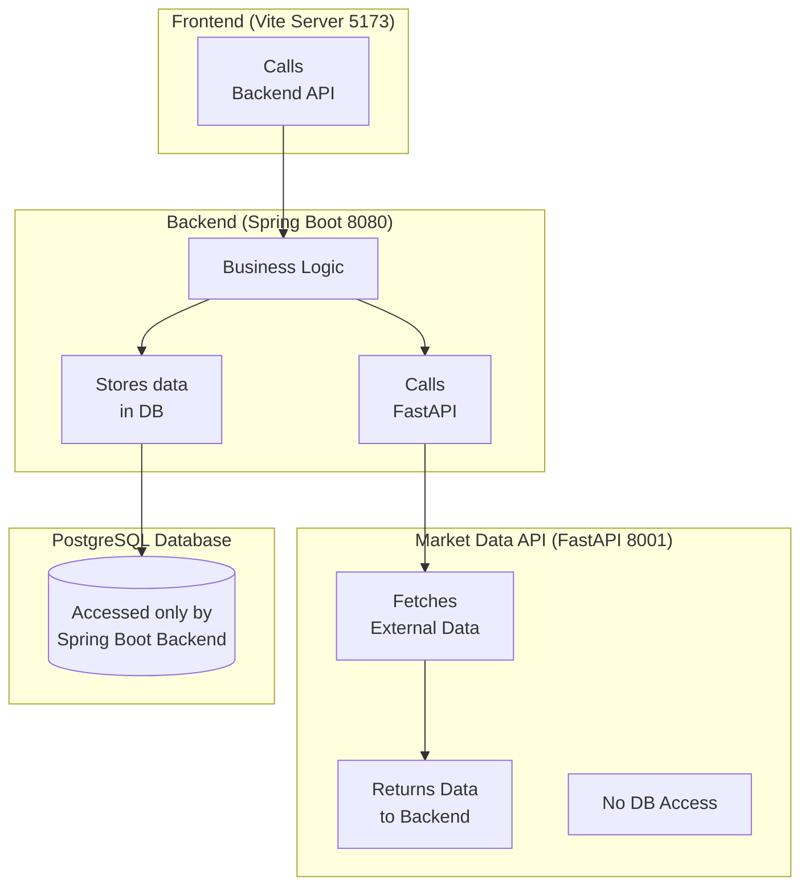

📦 Stock System — Cloud Architecture

🧭 Overview

A fully cloud‑native, production‑ready stock management system deployed on AWS, built with a secure, scalable, and serverless‑first architecture.
This cloud version replaces local Docker Compose orchestration with managed AWS services, enabling high availability, automatic scaling, and infrastructure-as-code provisioning.

Core Components
- Frontend: React + Vite (hosted on S3, delivered via CloudFront CDN)
- Backend: Spring Boot API running on ECS Fargate
- Market Data Fetcher: AWS Lambda (scheduled stock data ingestion)
- Container Registry: Amazon ECR
- Database: Amazon RDS (PostgreSQL, private subnet only)
- Load Balancing: Application Load Balancer (ALB)
- Networking: VPC with public/private subnets, SG‑based isolation
- Infrastructure: Terraform (full IaC)

🏗️ System Architecture



👉 Stock System — Full Stack Architecture

🔧 Local Development Environment

A dedicated local development environment is available in the dev branch.

It includes a Docker Compose–based architecture, service wiring, environment variables, and a separate architecture diagram tailored for local workflows.

🧭 Overview

A fully containerized multi-service stock management system built with:
- Frontend: Vite
- Backend: Spring Boot
- Market Data Service: FastAPI
- Database: PostgreSQL
- Orchestration: Docker Compose
- Automation: Makefile
This project is designed for clean architecture, easy onboarding, and production-ready deployment.

🏗️ System Architecture



📁 Project Structure
```
stock-system/
│
├── stock-system-frontend/       # Vite frontend
│   ├── src/
│   ├── public/
│   ├── .env.example
│   ├── vite.config.js
│   └── Dockerfile
│
├── stock-system-backend/        # Spring Boot backend
│   ├── src/main/java
│   ├── src/main/resources
│   ├── pom.xml
│   └── Dockerfile
│
├── stock-system-marketdata/     # FastAPI service
│   ├── app/
│   ├── requirements.txt
│   └── Dockerfile
│
├── docker-compose.dev.yml       # Dev environment
├── docker-compose.prod.yml      # Production environment
├── Makefile                     # Automation commands
└── README.md
```

🚀 Development Environment

Prerequisites
- Docker Desktop
- PowerShell + Scoop (for make)
- Git
Start Dev Environment
make dev

🏭 Production Build

make prod

This will:
- Build frontend static files
- Build backend JAR
- Build FastAPI image
- Start production docker-compose

🔧 Environment Variables
- Frontend (.env.example)
- VITE_MARKETDATA_API_URL=http://localhost:8001
- VITE_API_BASE=http://localhost:8080
- VITE_APP_ENV=development

Developers copy:
- cp .env.example .env

🐳 Docker Services

Dev Mode
- Hot reload for frontend
- Hot reload for FastAPI
- Spring Boot dev mode
- Bind mounts for all services
Prod Mode
- Optimized images
- No bind mounts
- Static frontend served by backend or Nginx (optional)

🛠️ Makefile Commands
- make dev       # Start dev environment
- make prod      # Start production environment
- make logs      # View logs
- make down      # Stop all containers
