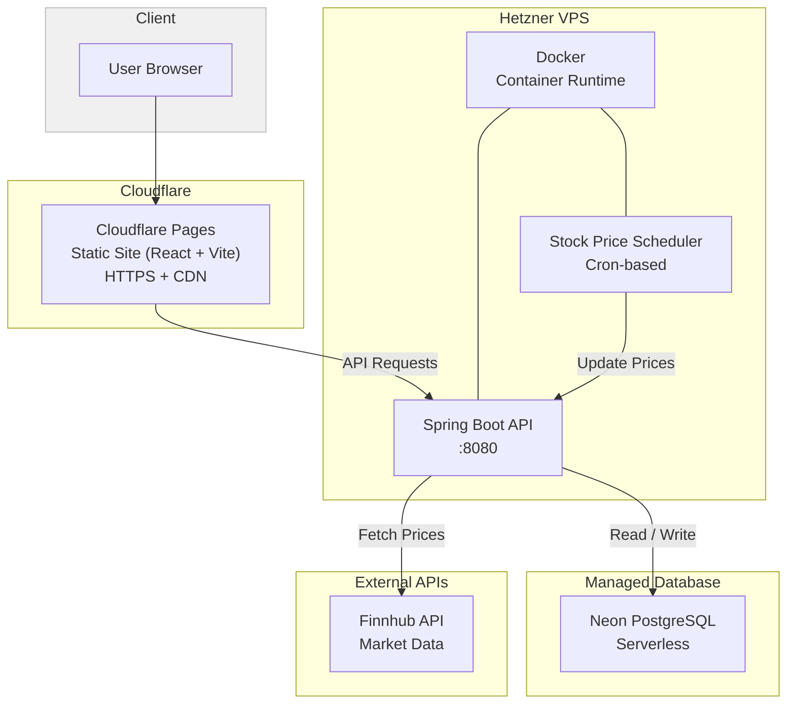
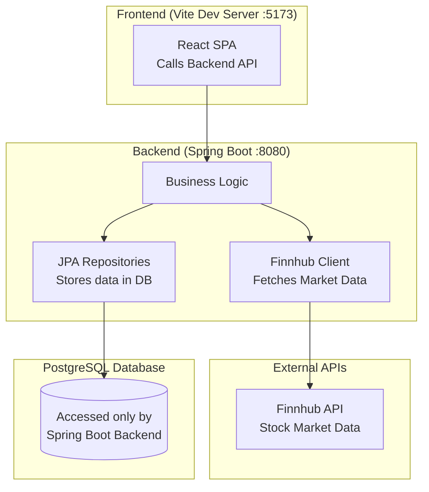

📦 Stock System — Architecture

🧭 Overview

A production-ready stock portfolio management system, built with a modern, cost-effective cloud architecture.

> **Note:** The production architecture is currently in transition from AWS to the stack described below. The final architecture is not yet finalized.

### Planned Production Stack
- Frontend: React + Vite (hosted on Cloudflare Pages)
- Backend: Spring Boot API (Hetzner VPS with Docker)
- Database: Neon (Serverless PostgreSQL)
- Market Data: Finnhub API (integrated directly into Spring Boot)
- Infrastructure: Terraform (IaC)

🏗️ System Architecture (Planned)


```mermaid
flowchart TB
 subgraph Client["Client"]
        Browser["User Browser"]
  end
 subgraph CDN["Cloudflare"]
        CF["Cloudflare Pages<br>Static Site (React + Vite)<br>HTTPS + CDN"]
  end
 subgraph VPS["Hetzner VPS"]
        Docker["Docker<br>Container Runtime"]
        API["Spring Boot API<br>:8080"]
        Scheduler["Stock Price Scheduler<br>Cron-based"]
  end
 subgraph DB["Managed Database"]
        Neon["Neon PostgreSQL<br>Serverless"]
  end
 subgraph External["External APIs"]
        Finnhub["Finnhub API<br>Market Data"]
  end
    Browser --> CF
    CF -- API Requests --> API
    Docker --- API & Scheduler
    API -- Read / Write --> Neon
    API -- Fetch Prices --> Finnhub
    Scheduler -- Update Prices --> API

    Client:::client
    classDef client fill:#f0f0f0,stroke:#bbb
```

👉 Stock System — Full Stack Architecture

🔧 Local Development Environment

A dedicated local development environment is available in the dev branch.

It includes a Docker Compose–based architecture, service wiring, environment variables, and a separate architecture diagram tailored for local workflows.

🧭 Overview

A fully containerized multi-service stock management system built with:
- Frontend: React + Vite + TypeScript
- Backend: Spring Boot (includes Finnhub market data integration)
- Database: PostgreSQL
- Observability: Grafana + Loki + Prometheus + Alloy
- Orchestration: Docker Compose
- Automation: Makefile
This project is designed for clean architecture, easy onboarding, and production-ready deployment.

🏗️ System Architecture


```mermaid
flowchart TB
 subgraph FE["Frontend (Vite Dev Server :5173)"]
        FE1["React SPA<br/>Calls Backend API"]
  end
 subgraph BE["Backend (Spring Boot :8080)"]
        BE1["Business Logic"]
        BE2["Finnhub Client<br/>Fetches Market Data"]
        BE3["JPA Repositories<br/>Stores data in DB"]
  end
 subgraph EXT["External APIs"]
        EXT1["Finnhub API<br/>Stock Market Data"]
  end
 subgraph DB["PostgreSQL Database"]
        DB1["Accessed only by<br/>Spring Boot Backend"]
  end
    FE1 --> BE1
    BE1 --> BE2 & BE3
    BE2 --> EXT1
    BE3 --> DB1

    FE1@{ shape: rect}
    BE1@{ shape: rect}
    BE2@{ shape: rect}
    BE3@{ shape: rect}
    EXT1@{ shape: rect}
    DB1@{ shape: cyl}
```

📁 Project Structure
```
stock-system/
│
├── stock-system-frontend/       # React + TypeScript + Vite frontend
│   ├── src/
│   ├── public/
│   ├── .env.example
│   ├── vite.config.ts
│   └── Dockerfile
│
├── stock-system-backend/        # Spring Boot backend (includes Finnhub integration)
│   ├── src/main/java
│   ├── src/main/resources
│   ├── pom.xml
│   └── Dockerfile
│
├── stock-system-infra/          # Terraform infrastructure as code
│   ├── modules/
│   ├── main.tf
│   ├── providers.tf
│   └── variables.tf
│
├── logging-config/              # Observability configs (Grafana, Loki, Prometheus)
│
├── docker-compose.dev.yml       # Dev environment
├── Makefile                     # Automation commands
├── AGENTS.md                    # AI assistant guidelines
├── STYLE_GUIDE.md               # API and code standards
└── README.md
```

🚀 Development Environment

Prerequisites
- Docker Desktop
- PowerShell + Scoop (for make)
- Git
Start Dev Environment
make dev

🔧 Environment Variables
- Frontend (.env.example)
- VITE_MARKETDATA_API_URL=http://localhost:8001
- VITE_API_BASE=http://localhost:8080
- VITE_APP_ENV=development

Developers copy:
- cp .env.example .env

🐳 Docker Services

Dev Mode
- Hot reload for frontend
- Hot reload for FastAPI
- Spring Boot dev mode
- Bind mounts for all services

🛠️ Makefile Commands
- make dev       # Start dev environment
- make logs      # View logs
- make down      # Stop all containers
