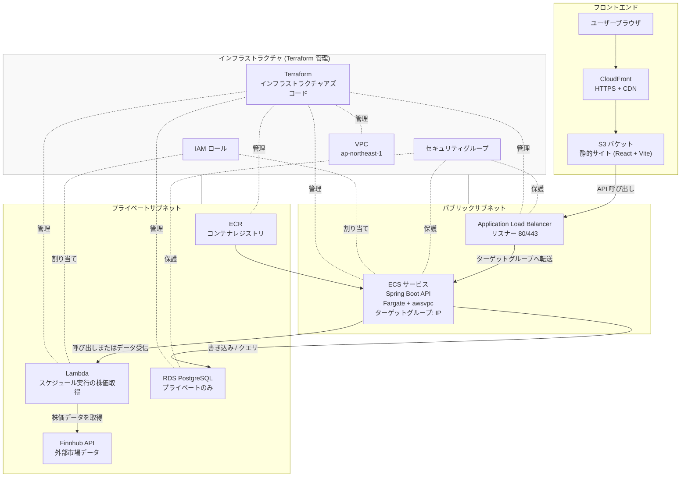

📦 Stock System — クラウドアーキテクチャ

🧭 概要

AWS に完全にデプロイされた本番環境対応のストック管理システムです。セキュリティ、スケーラビリティ、サーバーレスファーストアーキテクチャで構築されています。

このクラウドバージョンはローカルの Docker Compose オーケストレーションの代わりに、AWS マネージドサービスを使用して高可用性、自動スケーリング、インフラストラクチャアズコード（IaC）プロビジョニングを実現しています。

コンポーネント
- フロントエンド: React + Vite (S3 でホストされ CloudFront CDN で配信)
- バックエンド: ECS Fargate で実行される Spring Boot API
- 市場データ取得: AWS Lambda (スケジュール実行の株価データ取得)
- コンテナレジストリ: Amazon ECR
- データベース: Amazon RDS (PostgreSQL、プライベートサブネットのみ)
- ロードバランシング: Application Load Balancer (ALB)
- ネットワーク: VPC（パブリック/プライベートサブネット、セキュリティグループ単位での隔離）
- インフラストラクチャ: Terraform (完全 IaC)

🏗️ システムアーキテクチャ



📁 プロジェクト構成
```
stock-system/
│
├── stock-system-frontend/       # Vite フロントエンド
│   ├── src/
│   ├── public/
│   ├── .env.example
│   ├── vite.config.js
│   └── Dockerfile
│
├── stock-system-backend/        # Spring Boot バックエンド
│   ├── src/main/java
│   ├── src/main/resources
│   ├── pom.xml
│   └── Dockerfile
│
├── stock-system-marketdata/     # FastAPI サービス
│   ├── app/
│   ├── requirements.txt
│   └── Dockerfile
│
├── stock-system-infra/          # terraform
│   ├── modules/
│   ├── main.tf
│   └── providers.tf
│   └── variables.tf
│
├── docker-compose.dev.yml       # 開発環境
├── Makefile                     # 自動化コマンド
└── README.md
```

🚀 開発環境

前提条件

- Docker Desktop
- PowerShell + Scoop (make 用)
- Git
開発環境を開始する
```
make dev
```

🔧 環境変数

- フロントエンド (.env.example)
- VITE_MARKETDATA_API_URL=http://localhost:8001
- VITE_API_BASE=http://localhost:8080
- VITE_APP_ENV=development

🐳 Docker サービス

開発モード

- フロントエンド: ホットリロード対応
- FastAPI: ホットリロード対応
- Spring Boot: 開発モード
- すべてのサービス: バインドマウント対応

🛠️ Makefile コマンド

- make dev # 開発環境を開始
- make logs # ログを表示
- make down # すべてのコンテナを停止